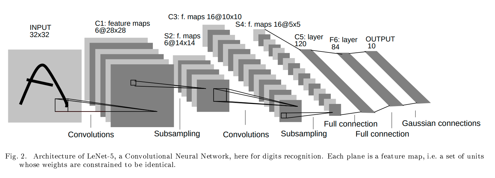

# LeNet-Tensorflow-Pytorch
Create LeNet model including Tensorflow and Pytorch packages

```
usage: main.py [-h] [--model {tf,torch}]

Create LeNet model in Tensorflow or Pytorch package

optional arguments:
  -h, --help          show this help message and exit
  --model {tf,torch}  Model will be created on Tensorflow, Pytorch (default: Tensorflow)
```

To create model in Tensorflow:

```
python3 main.py --model tf
```

To create model in Pytorch:

```
python3 main.py --model torch
```



Paper link: [Lenet paper](http://vision.stanford.edu/cs598_spring07/papers/Lecun98.pdf)